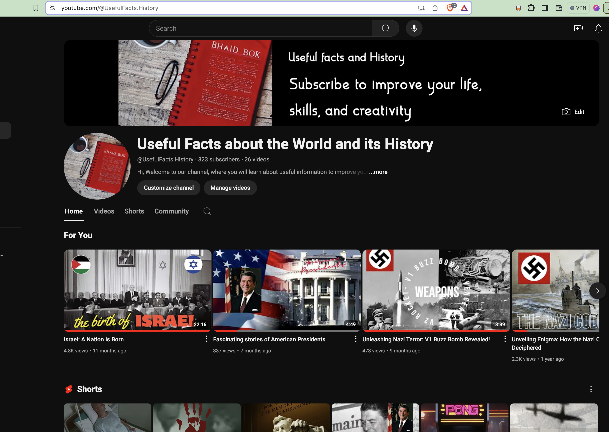
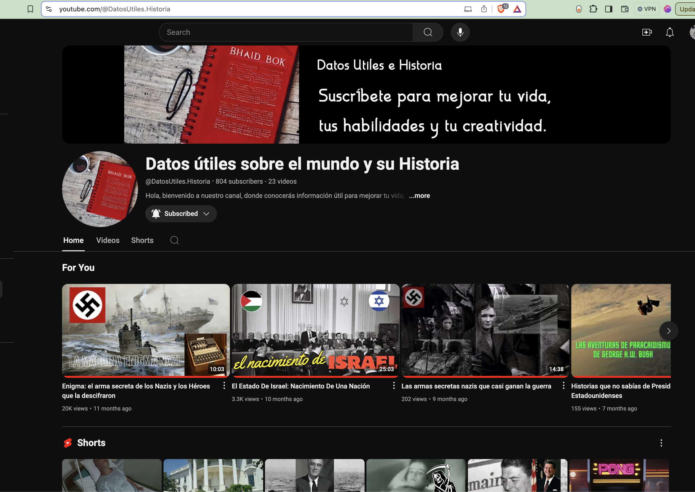
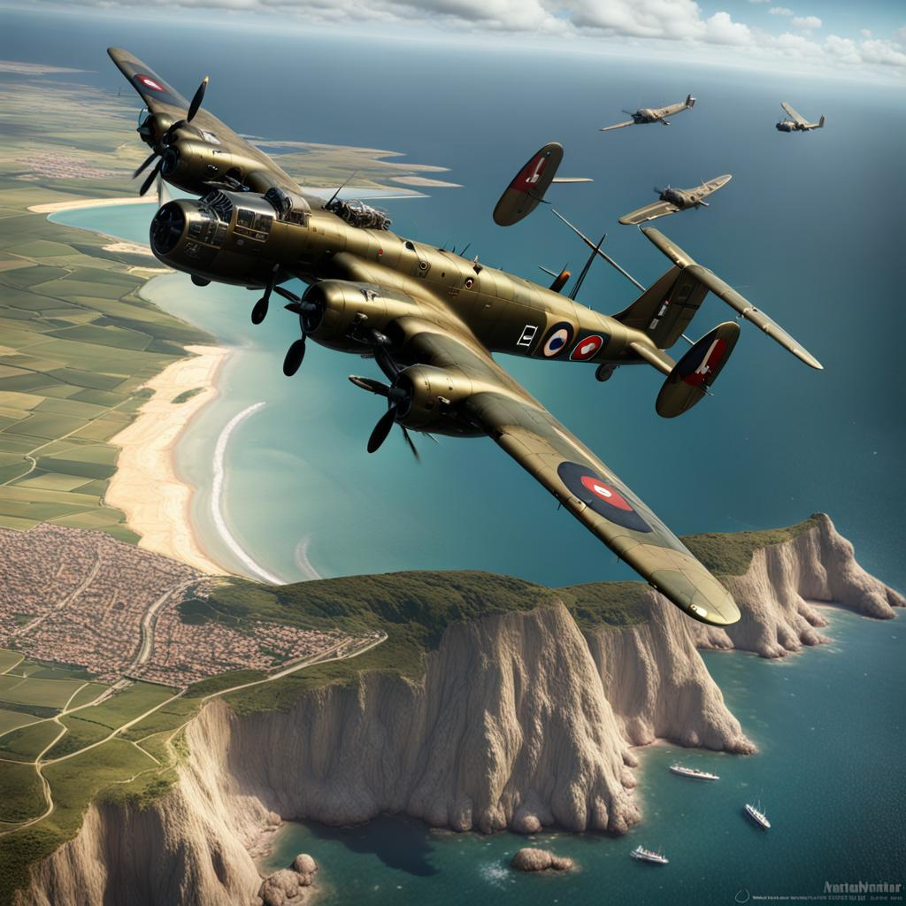
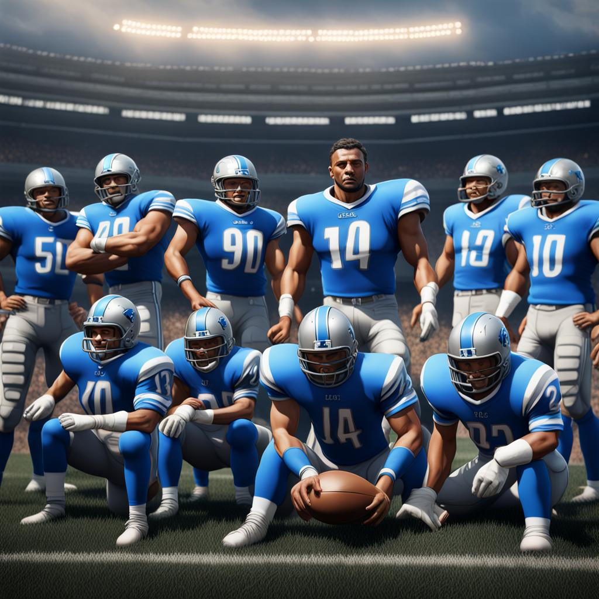
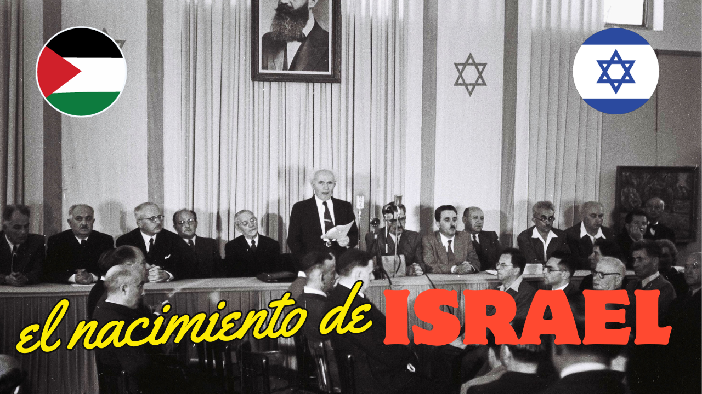
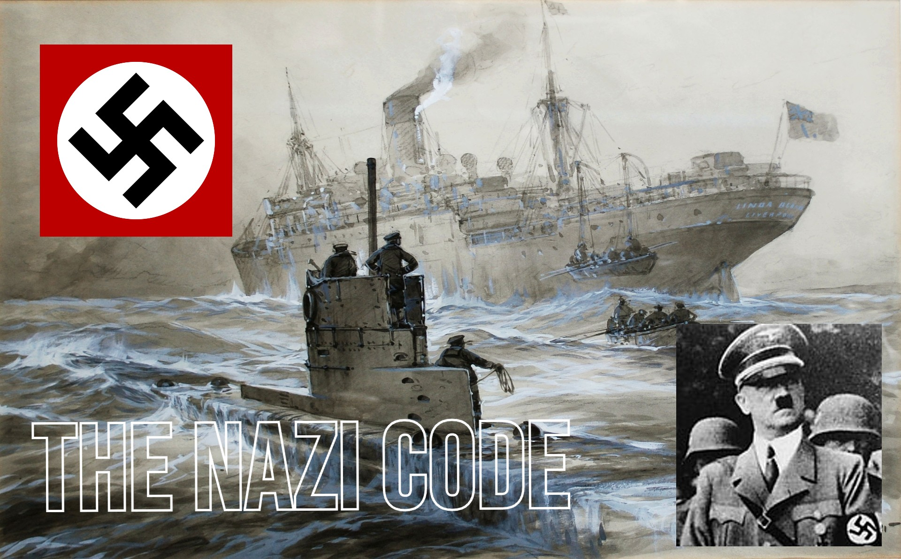

To learn more about all the different AI tools out there, I set out to build a faceless youtube channel. Many challenges came up, choosing a theme for the channel, what tools to use to create the screens, the content, generating the media, voiceovers, and others. After some back and forth, I decided to focus on a channel about Historical Facts. In this blog, I will detail the approach that i used to build the 2 youtube faceless channels and the different technical tooling used.
### Setup

The first step was to create the Youtube Channels. Initially, i created the <a href="https://www.youtube.com/@UsefulFacts.History" target="_blank">Useful Facts about the World and its History</a>. Later on, i created the spanish version of the channel, <a href="https://www.youtube.com/@DatosUtiles.Historia" target="_blank">Datos útiles sobre el mundo y su Historia</a>.

<table style="border-collapse: collapse;">
  <tr>
    <td style="border: none; padding: 0 10px;">
      
    </td>
    <td style="border: none; padding: 0 10px;">
    
    </td>
  </tr>
</table>

To create the main image and resources for the channels (thumbnails, logos,...), i used <a href="https://pixlr.com" target="_blank">Pixlr</a>. With a diverse range of photo editing tools, Pixlr allows you to swiftly edit and improve your photos.

### Ideas

To get ideas for creating new videos or shorts, I installed the
<a href="https://www.tubebuddy.com" target="_blank">TubeBuddy</a> and
<a href="https://www.vidiq.com" target="_blank">VidIq</a> browser extensions. These are tools that help YouTube creators optimize their videos and channels and generate ideas based on popular trends and the channel's theme and previous videos statistics. Other sources for ideas and topics were: a variety of "Historical Facts" related books, history themed you tube videos, Google popular Trends, and others.

### Building

For the first set of Youtube shorts and videos, I used <a href="https://fliki.ai" target="_blank">Fliki.Ai</a>. This is a media creation suite that uses AI to generate audio and video content. An all-in-one solution, it provides a number of design tools to setup screens, pictures and video libraries, a wide variety of voices in multiple languages for doing voiceovers, and a big library of background music to select from.

<table style="border-collapse: collapse;">
  <tr>
    <td style="border: none; padding: 0 10px;">
      
    </td>
    <td style="border: none; padding: 0 10px;">
        
    </td>
  </tr>
</table>

In addition, the tool generates new images using Artificial Intelligence by using AI prompting. Exporting videos for YouTube is easy and there is a variety of video formats.

Next, to write the script, I used a mix of different content sources, from books related to historical facts, youtube videos about historical content, web sites like <a href="https://www.wikiwand.com" target="_blank">Wikiwand</a> and many others, while utilizing <a href="https://chatgpt.com/" target="_blank">Chat GPT </a> and <a href="https://claude.ai/" target="_blank">Claude AI</a> for further research.

As mentioned before, Fliki.AI contains built-in options for voiceovers and background music, with many different options to select for each project.

To generate additional AI images, I used <a href="https://creator.nightcafe.studio" target="_blank">NightCafe</a>. This is a free AI art generator that allows users to create art using text prompts. See below a few sample images that were generated with NightCafe and used in the Youtube videos.
<table style="border-collapse: collapse;">
  <tr>
    <td style="border: none; padding: 0 10px;">
      
    </td>
    <td style="border: none; padding: 0 10px;">
        
    </td>
  </tr>
</table>

### Deploying

Before uploading to Youtube, we need to generate Thumbnails to add to the youtube video. I used
<a href="https://pixlr.com" target="_blank">Pixlr</a> for  creating this images. Pixlr is a cloud-based set of image editing tools and utilities, including AI image generation and enhancements. Below are a few examples of the thumbnails created for the youtube videos.

<table style="border-collapse: collapse;">
  <tr>
    <td style="border: none; padding: 0 10px;">
      
    </td>
    <td style="border: none; padding: 0 10px;">
        
    </td>
  </tr>
</table>

Finally, export the video in mp4 format from Fliki.AI, then using <a href="https://pixlr.com" target="_blank">Youtube Studio</a> for uploading. The upload process in Youtube Studio includes adding a title, description, Category, language and a few other information fields you will need to provide.

<table style="border-collapse: collapse;">
  <tr>
    <td style="border: none; padding: 0 10px;">
      
    </td>
  </tr>
</table>

### New Design Tool

For the last few videos, I decided to use a different design tool, <a href="https://canva.com" target="_blank">Canva Studio</a>. This tool gives you more flexibility on how to design your videos, however is not as straightforward like Fliki.AI. Canva does not have voiceovers built-in so, after reviewing a few voiceovers solutions i settled on <a href="https://aivoov.com" target="_blank">AIvoov</a>, mainly for their pricing structure.

<a href="https://www.youtube.com/@DatosUtiles.Historia" target="_blank">Datos útiles sobre el mundo y su Historia</a>...
<iframe width="560" height="315" src="https://www.youtube.com/embed/_9UldHa-YjE?si=_9KOSOQ2igIjtNpx" title="YouTube video player" frameborder="0" allow="accelerometer; autoplay; clipboard-write; encrypted-media; gyroscope; picture-in-picture; web-share" referrerpolicy="strict-origin-when-cross-origin" allowfullscreen></iframe>

<a href="https://www.youtube.com/@UsefulFacts.History" target="_blank">Useful Facts about the World and its History</a>...
<iframe width="560" height="315" src="https://www.youtube.com/embed/RWE7EgvE0TM?si=g9DsAGgnsLWKULt5" title="YouTube video player" frameborder="0" allow="accelerometer; autoplay; clipboard-write; encrypted-media; gyroscope; picture-in-picture; web-share" referrerpolicy="strict-origin-when-cross-origin" allowfullscreen></iframe>