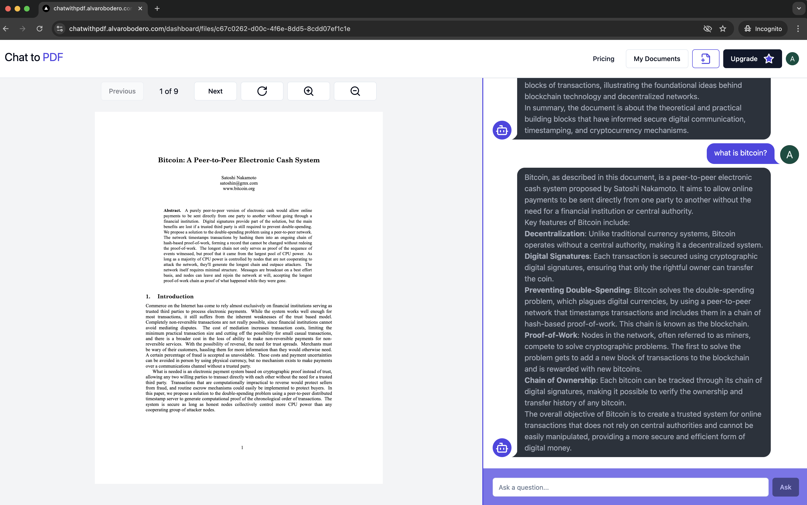
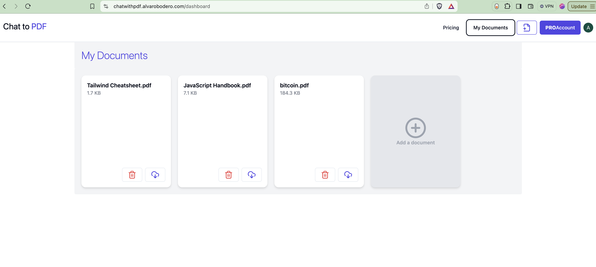
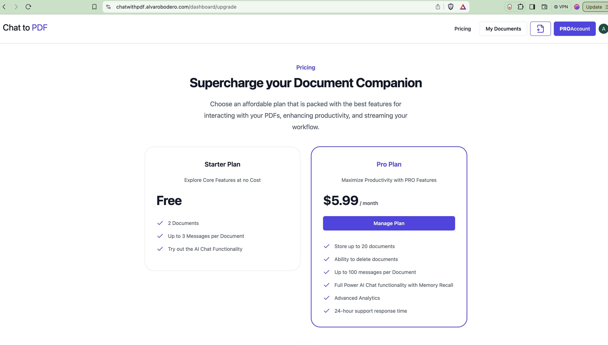

### Introduction
The Project I will discuss was showcased on a 5-Day ([Full Stack AI SaaS Challenge](https://www.youtube.com/watch?v=z0ZE6lnhdns&t=3221s)) presented by Sunny Sangha. The Challenge involved building a Web Application to upload PDF files and develop a Chat feature to interact with the documents and ask Questions using OpenAI.
### The Tech Stack
The tech stack used for this project:
<table style="border: 1px solid black; border-collapse: collapse;">
  <tr>
    <th style="border: 1px solid black; padding: 8px;">Technology</th>
    <th style="border: 1px solid black; padding: 8px;">Description</th>
    <th style="border: 1px solid black; padding: 8px;">Usage</th>
  </tr>
  <tr>
    <td style="border: 1px solid black; padding: 8px;"><a href="https://nextjs.org" target="_blank">NextJs</a></td>
    <td style="border: 1px solid black; padding: 8px;">Create high-quality web applications with the power of React components</td>
    <td style="border: 1px solid black; padding: 8px;">Build Upload, Chat, Upgrade and other web components</td>
  </tr>
  <tr>
    <td style="border: 1px solid black; padding: 8px;"><a href="https://firebase.google.com/products/storage" target="_blank">Firebase Storage</a></td>
    <td style="border: 1px solid black; padding: 8px;">Google Cloud Service </td>
    <td style="border: 1px solid black; padding: 8px;">Store pdf files uploaded by the user</td>
  </tr> 
  <tr>
    <td style="border: 1px solid black; padding: 8px;"><a href="https://firebase.google.com/products/firestore" target="_blank">Firestore</a></td>
    <td style="border: 1px solid black; padding: 8px;">NoSQL Cloud Database</td>
    <td style="border: 1px solid black; padding: 8px;">Store User info</td>
  </tr>
  <tr>
    <td style="border: 1px solid black; padding: 8px;"><a href="https://www.pinecone.io" target="_blank">PineCone</a></td>
    <td style="border: 1px solid black; padding: 8px;">Cloud-native vector database</td>
    <td style="border: 1px solid black; padding: 8px;">Store pdf document embeddings</td>
  </tr>
  <tr>
    <td style="border: 1px solid black; padding: 8px;"><a href="https://www.langchain.com" target="_blank">LangChain</a></td>
    <td style="border: 1px solid black; padding: 8px;">Framework for developing applications with LLM</td>
    <td style="border: 1px solid black; padding: 8px;">Used to query OpenAI</td>
  </tr>
  <tr>
    <td style="border: 1px solid black; padding: 8px;"><a href="https://www.openai.com" target="_blank">OpenAI</a></td>
    <td style="border: 1px solid black; padding: 8px;">Artificial Intelligence Research Lab </td>
    <td style="border: 1px solid black; padding: 8px;">Generate responses to user's question</td>
  </tr>
    <tr>
    <td style="border: 1px solid black; padding: 8px;"><a href="https://www.clerk.dev" target="_blank">Clerk</a></td>
    <td style="border: 1px solid black; padding: 8px;">User Authentication and Management Service</td>
    <td style="border: 1px solid black; padding: 8px;">Authenticate and manage users sessions</td>
  </tr>
</table>

### Main Features

This application has a set of components that enables a user to interact with PDF files and ask questions about the content of each file.
The user first signs up and authenticates into the system via the Clerk utilities. An authenticated user can proceed to upload PDF documents into a personal library. The user can then start Chatting with the document by selecting a document.

Once on the Chat page, the user can proceed to query the document, by typing in a question regarding the document. The application then queries OpenAI to request an answer based on the contents of the document. In addition, a "chat context" for the existing chat enables a human like interaction with the document.

### Components

Some of the main components built into this application are: Chat, Document Library, Pricing/Upgrade, Logoff, and others. here is som more details on how these components functionality.

##### Chat component

##### Document library

##### Pricing/Upgrade

##### Logoff
This functionality was added to the Hackathon codebase to enable Automatic loggoff if the user is inactive for more than 10 minutes.

### Conclusion
In conclusion, the Chat With PDF application has a multitude of top of the line technologies to interact with AI and build out a professional SAAS application, from Signup, to Pricing functionality, to enforcing security and full interaction with OpenAI to implement Artifical intelligence Use cases.  My fully featured implementation demo can be accessed here ...

In addition, you can find below the youtube link to the first Day of the Challenge if you want to check it out.
<iframe width="560" height="315" src="https://www.youtube.com/embed/z0ZE6lnhdns?si=gUBQkU6yUpGXlMgM" title="YouTube video player" frameborder="0" allow="accelerometer; autoplay; clipboard-write; encrypted-media; gyroscope; picture-in-picture; web-share" referrerpolicy="strict-origin-when-cross-origin" allowfullscreen></iframe>